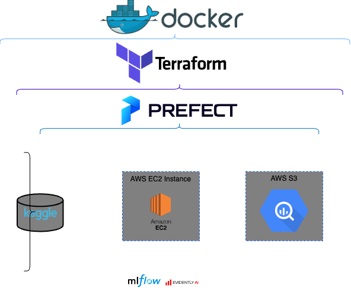
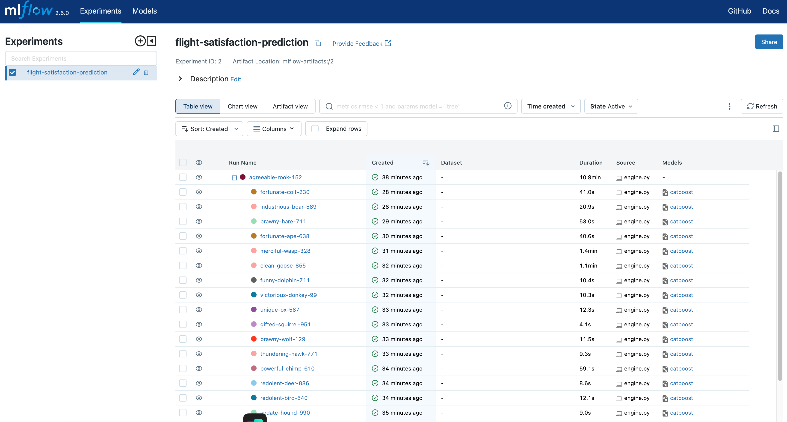
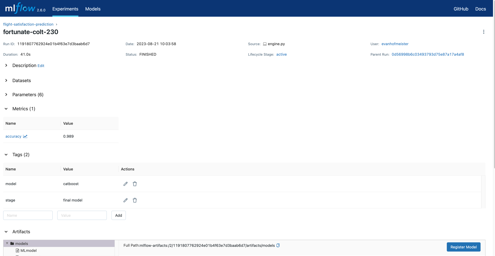

# MLOps Zoomcamp Final Porject - Predict Airline Satisfaction
Project to create pipeline to apply MLOps technologies covered in Data Talks Club MLOps Zoomcamp.

# Problem Statement

This project attempts to create a MLOps pipeline to predict airline customer satisfaction using a handful of available metrics that are tracked by the airline. This pipeline utilizes enviornment creation (Docker), infrastructure as code (IaC) (Terraform), workflow orchestration (Prefect), Cloud (AWS), Experement tracking tools (MLFlow), and Monitoring (Evidently). After EDA and general model comparison performed in `flight-satisfaction-prediction-scratch.ipynb`, CatBoost model is selected for use in pipeline and further hyperperameter tuning.

## Data 
The dataset can be sourced from [Kaggle](https://www.kaggle.com/datasets/teejmahal20/airline-passenger-satisfaction)

This dataset contains an airline passenger satisfaction survey.

Gender: Gender of the passengers (Female, Male)

Customer Type: The customer type (Loyal customer, disloyal customer)

Age: The actual age of the passengers

Type of Travel: Purpose of the flight of the passengers (Personal Travel, Business Travel)

Class: Travel class in the plane of the passengers (Business, Eco, Eco Plus)

Flight distance: The flight distance of this journey

Inflight wifi service: Satisfaction level of the inflight wifi service (0:Not Applicable;1-5)

Departure/Arrival time convenient: Satisfaction level of Departure/Arrival time convenient

Ease of Online booking: Satisfaction level of online booking

Gate location: Satisfaction level of Gate location

Food and drink: Satisfaction level of Food and drink

Online boarding: Satisfaction level of online boarding

Seat comfort: Satisfaction level of Seat comfort

Inflight entertainment: Satisfaction level of inflight entertainment

On-board service: Satisfaction level of On-board service

Leg room service: Satisfaction level of Leg room service

Baggage handling: Satisfaction level of baggage handling

Check-in service: Satisfaction level of Check-in service

Inflight service: Satisfaction level of inflight service

Cleanliness: Satisfaction level of Cleanliness

Departure Delay in Minutes: Minutes delayed when departure

Arrival Delay in Minutes: Minutes delayed when Arrival

Satisfaction: Airline satisfaction level(Satisfaction, neutral or dissatisfaction)

## Data Pipeline

Note, due to time contraints, I was not able to implement Docker/EvidentlyAI, CI/CD, and a few other elements I had originally intended to build.

## Docker

Docker is a technology that lets you package and run applications in isolated, consistent environments called containers. Containers are lightweight, portable, and efficient, making it easy to develop, deploy, and scale applications across different systems. It ensures applications work the same way in any environment, from development to production, improving efficiency and collaboration between teams.

## Terraform 

Terraform is an open-source infrastructure as code (IaC) tool used to build, manage and version infrastructure resources across multiple cloud providers, including AWS, Azure, and Google Cloud Platform. It allows you to define your infrastructure in code, and then provision and manage it using simple and repeatable workflows. With Terraform, you can automate the deployment and scaling of infrastructure resources, ensuring consistency and reducing the risk of errors.

## Prefect

Prefect is a Python-based open-source workflow automation tool used to build, schedule, and monitor data workflows. It provides a flexible and scalable platform for creating workflows that can run on your local machine or in the cloud. With Prefect, you can define your workflows as code, and then execute them on any infrastructure, making it easy to scale and integrate with your existing systems.

Airflow is also an open-source workflow automation tool, but it focuses on data processing and has a strong emphasis on scheduling and task dependencies. It allows you to define workflows using Python code, and then schedule and monitor their execution using a web-based interface. Airflow has a large community and many plugins available, making it a popular choice for data engineering and data science teams.

The main difference between Prefect and Airflow is their approach to workflow execution. Prefect is designed to be more flexible and can run workflows on any infrastructure, while Airflow has a strong focus on scheduling and task dependencies. Additionally, Prefect has a modern architecture that allows for easier customization and debugging, while Airflow has a more established ecosystem and is known for its stability and reliability. Ultimately, the choice between Prefect and Airflow will depend on your specific use case and requirements.

## Data Cloud Storage and Warehouse

Amazon Web Services (AWS) is a comprehensive cloud computing platform offered by Amazon. It provides a wide range of services that enable individuals, businesses, and organizations to build and manage various applications and services without the need for physical hardware. Some of the most popular AWS tools and services include:

Amazon EC2 (Elastic Compute Cloud): Virtual servers in the cloud, allowing users to scale computing resources up or down as needed.

Amazon S3 (Simple Storage Service): Scalable storage solution for storing and retrieving data, suitable for various applications like backups, static website hosting, and data archiving.

Amazon RDS (Relational Database Service): Managed database service supporting various database engines like MySQL, PostgreSQL, SQL Server, and more.

AWS Lambda: Serverless compute service that lets you run code in response to events without provisioning or managing servers.

Amazon Sagemaker: Fully managed service for building, training, and deploying machine learning models.

Amazon Redshift: Data warehousing service for running complex queries and analytics on large datasets.

These are just a few examples of the extensive range of services offered by AWS. For this project, we will only be utilizing EC2 and S3 services.

## MLFlow

MLflow is a comprehensive platform that simplifies the management of the end-to-end machine learning lifecycle. It provides tools for tracking, sharing, and deploying machine learning models in a collaborative environment. With MLflow, data scientists can easily experiment with different algorithms, track model versions, and organize their work. It also supports model deployment and monitoring, enabling seamless transition from experimentation to production. MLflow streamlines the development process, fosters collaboration among teams, and enhances the reproducibility and scalability of machine learning projects.

## EvidentlyAI

EvidentlyAI is a platform designed to enhance the development and deployment of machine learning models. It offers tools for model analysis, interpretation, and monitoring, helping data scientists and engineers ensure their models are transparent, reliable, and performing as expected. With EvidentlyAI, you can gain insights into model behavior, identify potential issues, and maintain the quality of machine learning systems throughout their lifecycle. This platform promotes better understanding and trust in AI models, fostering improved decision-making and accountability.

## Project setup

### Requirements 
*  [Docker](https://www.docker.com/)
*  [Terraform](https://www.terraform.io/)
*  [Prefect](https://www.prefect.io/)
*  [AWS](https://aws.amazon.com/)
*  [MLFlow](https://mlflow.org/)
*  [EvidentlyAI](https://www.evidentlyai.com/)

### Setup Enviornment

Create a virtual environment

`conda create --name py35 python=3.10`

Install libraries

`pip install -r ~/mlops-zoomcamp-project/requirements.txt`

### API Keys

The data is available in the `~\data directory`, but you can also source it by creating a Kaggle account and downloading your credentials in a Json format for use with the Kaggle python library.

### Setup AWS

`ssh-keygen -t rsa -b 4096`

`ssh-keygen -f <Local directory to store private keys>/mlops_key_pair2 -t rsa -b 4096`

`ssh -i <Location of private key on local machine> -L localhost:8888:localhost:8888 ubuntu@<EC2 IP Address>`

### Setup Terraform

`cd ~/mlops-zoomcamp-project/terraform`

`terraform init`

`terraform plan`

`terraform apply`

### Setup Prefect

`cd ~/mlops-zoomcamp-project`

`conda activate prefect-env`

`prefect deployment build prefect/main_flow.py:main -n Example_flow`

`prefect deployment apply main-deployment.yaml`

`prefect agent start -q 'default'`

### MLFlow

`mlflow ui --host localhost:5000 --backend-store-uri sqlite:///mlflow.db`

### Result 

After setting up the infrastructure and running prefect, you should see the final optimized CatBoost model in MLFlow:

